<picture>
  <source media="(prefers-color-scheme: dark)" srcset="dark.svg">
  <source media="(prefers-color-scheme: light)" srcset="light.svg">
  
</picture>

  

### About Me

I'm an Artificial Intelligence & Robotics undergraduate at MITS Gwalior who enjoys building complete engineering systems — from CAD design and embedded electronics to ROS 2 software and simulation. I learn new technologies by designing, building, testing, documenting, and continuously improving real hardware and software.

**Long-term goal:** contribute to robotics products used in manufacturing, logistics, healthcare, and autonomous systems.

---

### Featured Projects

**[6-DOF Robotic Arm](https://github.com/Besumit00/6-Dof-Robotic-arm)** — Fusion 360
My first CAD project. A complete 6-DOF robotic arm designed from scratch — parametric modeling, full assembly, motion-ready revolute joints. Current end effector is a rigid placeholder; an actuated gripper is planned next.

**ROS 2 Autonomous Delivery Robot** — ROS2 · Gazebo · RViz · URDF · SLAM · Nav2
Custom URDF modeling with differential drive kinematics and TF tree configuration. Gazebo simulation with Lidar, odometry, and sensor plugins. Currently integrating SLAM Toolbox; Nav2 stack planned next.

**Self-Balancing Robot** — Arduino · MPU6050 · PID · Fusion 360 · 3D Printing
Custom multi-deck chassis designed in Fusion 360, 3D printed and assembled. Real-time PID balance control using MPU6050 IMU data and an H-bridge motor driver.

**IoT Industrial Motor Health Monitoring System** — ESP32 · ThingSpeak · Wokwi · DHT22 · MPU6050
Predictive maintenance system monitoring temperature, vibration, and RPM with three-tier fault detection (Normal / Warning / Critical) and cloud dashboard visualization.

**Automatic Toll Gate System** — Arduino · RFID · IR Sensors · Servo
RFID-based vehicle authentication with automated gate actuation and real-time status indicators.

**E-Commerce Analytics Dashboard** — Excel · Power Query · Pivot Tables
Relational multi-table dashboard analyzing 100K+ orders from the Olist dataset, with dynamic KPIs and slicers.

---

### Current Learning Roadmap

ROS 2 Humble ecosystem &nbsp;·&nbsp; SLAM &amp; Navigation2 &nbsp;·&nbsp; MoveIt 2 &nbsp;·&nbsp; PLC Programming &nbsp;·&nbsp; PCB Design &nbsp;·&nbsp; Advanced SQL &amp; Data Analytics

### Connect

[GitHub](https://github.com/Besumit00) · [LinkedIn](https://www.linkedin.com/in/sumit-sahu-10003040a) · sumit.0sahu2003@gmail.com
